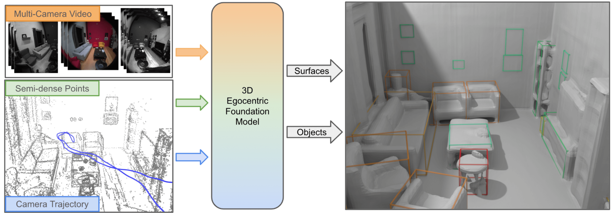

# EFM3D: A Benchmark for Measuring Progress Towards 3D Egocentric Foundation Models

[[paper](https://arxiv.org/abs/2406.10224)]
[[website](https://www.projectaria.com/research/efm3D/)]

## Intro

This is the official release for the paper EFM3D: A Benchmark for Measuring
Progress Towards 3D Egocentric Foundation Models
(https://arxiv.org/abs/2406.10224). To measure progress on what we term
Egocentric Foundation Models (EFMs) we establish EFM3D, a benchmark with two
core 3D egocentric perception tasks. EFM3D is the first benchmark for 3D object
detection and surface regression on high quality annotated egocentric data of
[Project Aria](https://www.projectaria.com/). We also propose Egocentric Voxel
Lifting (EVL), a baseline for 3D EFMs.



We provide the following code and assets

- The pretrained EVL model weights for surface reconstruction and 3D object
  detection on Aria sequences
- The datasets included in the EFM3D benchmark, including the training and
  evaluation data for Aria Synthetic Datasets (ASE), Aria Everyday Objects (AEO)
  for 3D object detection, and the eval mesh models for surface reconstruction
  evaluation.
- Distributed training code to train EVL.
- Native integration with
  [Aria Training and Evaluation Kit (ATEK)](https://github.com/facebookresearch/atek).

The following serves as a minimal example to run the model inference, including
installation guide, data downloading instructions and how to run the inference
code.

## Installation

**Option 1**: First navigate to the root folder. The core library is written in
PyTorch, with additional dependencies listed in `requirements.txt`.
This needs Python>=3.9

```
pip install -r requirements.txt
```

**Option 2 (Slow)**: You can choose to use [conda](https://anaconda.org/anaconda/conda)
to manage the dependencies. The runtime dependencies can be installed by running

```
conda env create --file=environment.yml
conda activate efm3d
```

This should be sufficient to initiate the use of the EVL model inference with
the pretrained model weights. please refer to [INSTALL.md](INSTALL.md) for a full installation, which is required for training and eval,

## Inference

### Pretrained models

Download the pretrained model weights and a sample data on the [EFM3D](https://www.projectaria.com/research/efm3D/#download-dataset) page (email required).
We provide two model checkpoints, one for server-side GPU (>20GB GPU memory) and one for desktop GPU. There is a sample sequence attached
to the model weights to facilitate using the model.
Check out the [README.md](ckpt/README.md) for detailed instructions on how to download the model weights.


### Run on the sample data
After downloading the model weights `evl_model_ckpt.zip`, put it under `${EFM3D_DIR}/ckpt/`,
then run the command under `${EFM3D_DIR}`

```
sh prepare_inference.sh
```

This will unzip the file, make sure the model weights and sample data are put under the right paths.
To run inference on the sample sequence
```
python infer.py --input ./data/seq136_sample/video.vrs
```

**Note**: the pretrained model requires ~20GB GPU memory. Use the following
command to run the model on a desktop GPU with ~10GB memory (tested on
RTX-3080). The performance is downgraded a bit.

```
python infer.py --input ./data/seq136_sample/video.vrs --model_ckpt ./ckpt/model_lite.pth --model_cfg ./efm3d/config/evl_inf_desktop.yaml --voxel_res 0.08
```

This wraps up the basic usage of EVL model. To train the model from scratch and
use the EFM3D benchmark, have a full installation following
[INSTALL.md](INSTALL.md) then read below

### Inference with ATEK

The inference also supports taking [ATEK-format](https://github.com/facebookresearch/atek) WDS sequences. First download a
test ASE sequence following the `ASE eval data` section in [README.md](data/README.md), then run

```
python infer.py --input ./data/ase_eval/81022
```

## Datasets

See [README.md](data/README.md) for instructions to work with all datasets included in the EFM3D benchmark.
There are three datasets in the EFM3D benchmark

- [Aria Synthetic Environments (ASE)](https://www.projectaria.com/datasets/ase/): for training and eval on 3D object detection and surface reconstruction
- [Aria Digital Twin (ADT)](https://www.projectaria.com/datasets/adt/): for eval on surface reconstruction
- [Aria Everyday Objects (AEO)](https://www.projectaria.com/datasets/aeo/): for eval on 3D object detection.

## Train EVL

First make sure you have a full installation (see [INSTALL.md](INSTALL.md)).
Train the EVL model from scratch requires downloading the full ASE training data
You can download a small subset of ASE sequences (>10 sequences) to test the
training script. Check out the `ASE training data` section in
[data/README.md](data/README.md). After following the instructions to prepare
the data, run the following command.

- train the EVL model from scratch on a single GPU

```
python train.py
```

- train with 8 GPUs

```
torchrun --standalone --nproc_per_node=8 train.py
```

We also provide a script to train on multi-node multi-gpu environment via
[slurm](https://slurm.schedmd.com/documentation.html). The pretrained model is
trained on 2 nodes with 8xH100.

- train with multi-node multi-gpu using slurm

```
sbatch sbatch_run.sh
```

By default the tensorboard log is saved to ${EFM3D_DIR}/tb_logs

## EFM3D benchmark

Please see [benchmark.md](benchmark.md) for details.

## Citing EFM3D

```
@article{straub2024efm3d,
  title={EFM3D: A Benchmark for Measuring Progress Towards 3D Egocentric Foundation Models},
  author={Straub, Julian and DeTone, Daniel and Shen, Tianwei and Yang, Nan and Sweeney, Chris and Newcombe, Richard},
  journal={arXiv preprint arXiv:2406.10224},
  year={2024}
}

@inproceedings{pan2023aria,
  title={Aria digital twin: A new benchmark dataset for egocentric 3d machine perception},
  author={Pan, Xiaqing and Charron, Nicholas and Yang, Yongqian and Peters, Scott and Whelan, Thomas and Kong, Chen and Parkhi, Omkar and Newcombe, Richard and Ren, Yuheng Carl},
  booktitle={Proceedings of the IEEE/CVF International Conference on Computer Vision},
  pages={20133--20143},
  year={2023}
}

@article{avetisyan2024scenescript,
  title={SceneScript: Reconstructing Scenes With An Autoregressive Structured Language Model},
  author={Avetisyan, Armen and Xie, Christopher and Howard-Jenkins, Henry and Yang, Tsun-Yi and Aroudj, Samir and Patra, Suvam and Zhang, Fuyang and Frost, Duncan and Holland, Luke and Orme, Campbell and others},
  journal={arXiv preprint arXiv:2403.13064},
  year={2024}
}
```

## How to Contribute

We welcome contributions! Go to [CONTRIBUTING](./.github/CONTRIBUTING.md) and
our [CODE OF CONDUCT](./.github/CODE_OF_CONDUCT.md) for how to get started.

## License

EFM3D is released by Meta under the [Apache 2.0 license](LICENSE).
