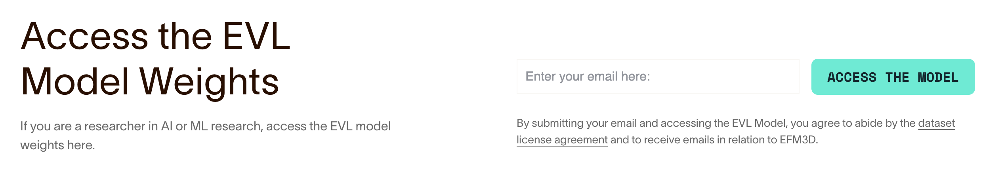
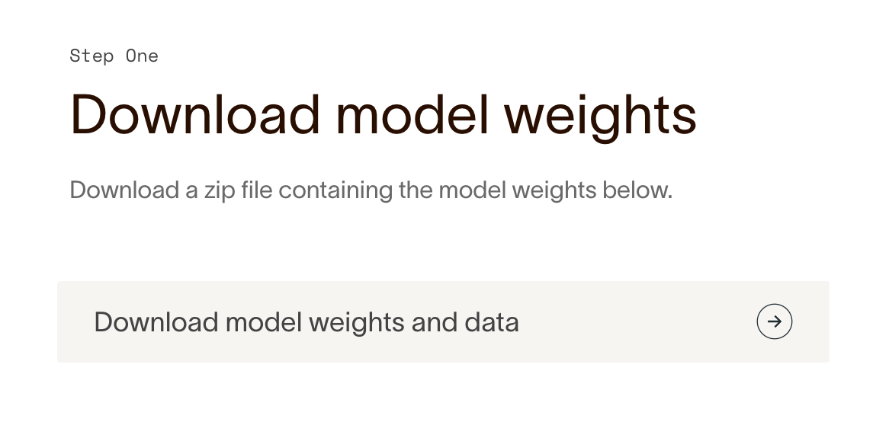

# EVL Model Weights

Download the model weights at
[Project Aria](https://www.projectaria.com/research/efm3D/) page.

- Enter your email to download the model weights



- The page will be updated after entering the email



- Download the model checkpoint and save it under the current folder
  (`<EFM3D_DIR>/ckpt`). You can also "Copy Link Address" and download the zip
  file using `curl`, which is useful when you're working in a server environment

```
curl -C - <downloadable_link> -o evl_model_ckpt.zip
```

- The zip file contains the following contents

| filename            | Description                                                                                                   |
| ------------------- | ------------------------------------------------------------------------------------------------------------- |
| `model_release.pth` | the default EVL model weights that is jointly trained on 3D object detection task and surface regression task |
| `model_lite.pth`    | the EVL model weights for desktop-GPU                                                                         |
| `seq136_sample.zip` | the sample test to test the EVL inference pipeline                                                            |
