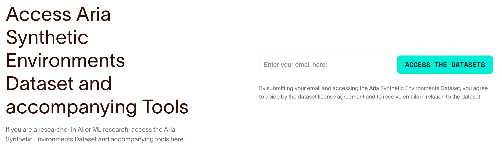
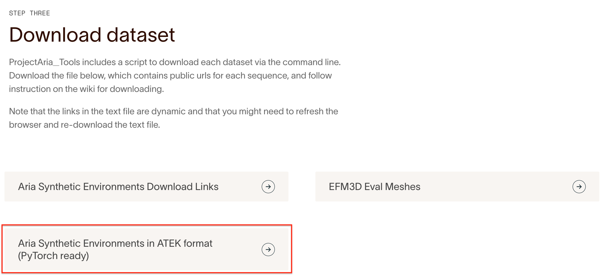
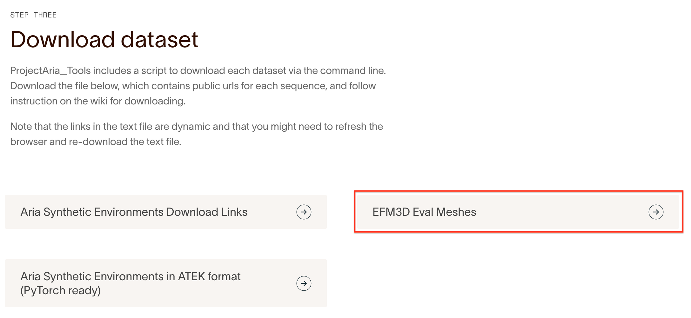
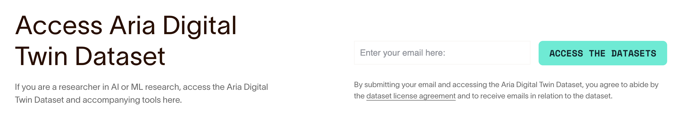
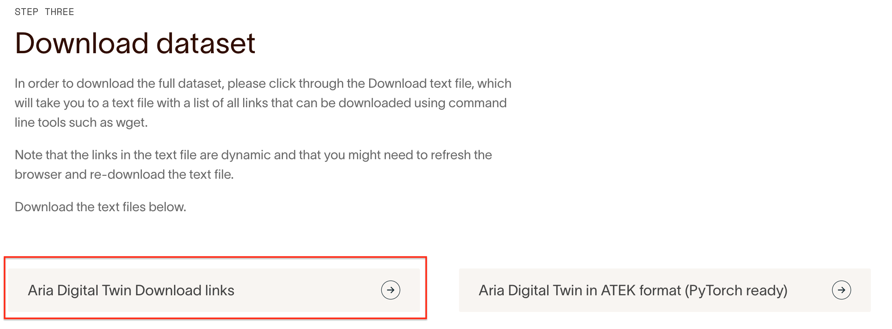
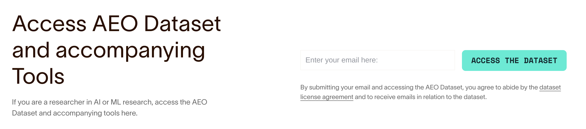
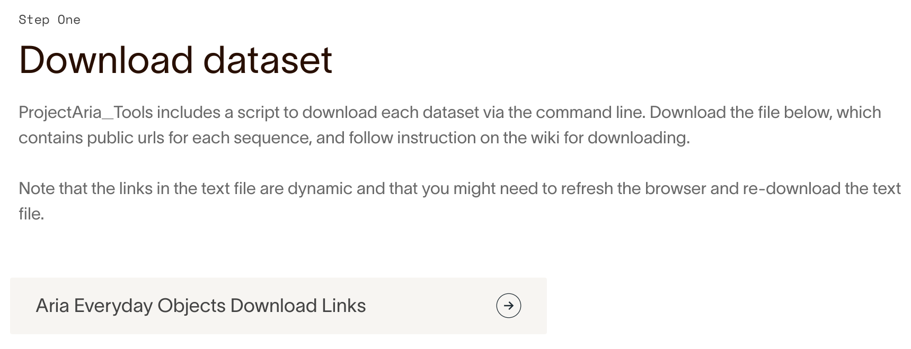

# EFM3D Data Instructions

The following sections describe the detailed instructions on how to work with
different datasets for training and evaluation purposes.

- [ASE: Aria Synthetic Environments](#aria-synthetic-environments-ase-dataset)
  - [ASE eval data](#ase-eval-data)
  - [ASE training data](#ase-training-data)
  - [ASE mesh](#ase-mesh)
- [ADT: Aria Digital Twin](#aria-digital-twin-adt-dataset)
  - [ADT mesh](#adt-mesh)
- [AEO: Aria Everyday Objects](#aria-everyday-objects-aeo-dataset)

## Aria Synthetic Environments (ASE) dataset

Go to the [ASE page](https://www.projectaria.com/datasets/ase/) on
projectaria.com, enter your email to get access to the metadata files.



### ASE eval data

Download the metadata file for ASE in ATEK format, named
`AriaSyntheticEnvironment_ATEK_download_urls.json` which contains all the url
paths to the ASE sequences. Put it under `<EFM3D_DIR>/data`.



Run the command to download the all 100 eval sequences to `ase_eval`,

```
python dataverse_url_parser.py --config-name efm_eval --input-json ./AriaSyntheticEnvironment_ATEK_download_urls.json --output-folder-path ./ase_eval --download-wds-to-local
```

Add the option `--max-num-sequences 1` to download one eval sequence to test

```
python dataverse_url_parser.py --config-name efm_eval --input-json ./AriaSyntheticEnvironment_ATEK_download_urls.json --output-folder-path ./ase_eval --download-wds-to-local --max-num-sequences 1
```

### ASE training data

Download a small-scale training set (10 sequences, using
`--max-num-sequences 10`) to try EVL [training](../train.py). You can also
download the full 10k sequences (~7TB data) to train the full model.

- Download a small-scale training set of 10 sequences. By default train/val
  split ratio is 90/10

```
python dataverse_url_parser.py --config-name efm --input-json ./AriaSyntheticEnvironment_ATEK_download_urls.json --output-folder-path ./ase_train --download-wds-to-local --max-num-sequences 10
```

- Download the full 10k training set, using the official train/val split. The
  complete dataset is ~7TB.

```
python dataverse_url_parser.py --config-name efm --input-json ./AriaSyntheticEnvironment_ATEK_download_urls.json --output-folder-path ./ase_train --download-wds-to-local --train-val-split-json-path ase_splits.json
```

By default this will save the training data to `${EFM3D_DIR}/data/ase_train`.
Run `python train.py` under `{EFM3D_DIR}` will kick off the training.

### ASE mesh

Download the metadata file for ASE mesh for surface reconstruction evaluation.
The button should download a file named `ase_mesh_download_urls.json`



Run the following command to download the 100 mesh ply files (~14GB) to evaluate
the mesh reconstruction in the [EFM3D](https://arxiv.org/abs/2406.10224)
benchmark. By default the mesh files will be saved to `ase_mesh` subfolder in
the current folder. See [benchmark.md](../benchmark.md) for more on surface
evaluation.

```
python download_ase_mesh.py
```

## Aria Digital Twin (ADT) dataset

EFM3D uses ADT dataset for surface reconstruction evaluation. To download the
dataset,

- Go to the [ADT page](https://www.projectaria.com/datasets/adt/) on
  projectaria.com, scroll down to the bottom of the page. Enter your email to
  download the json file containing all the ADT paths.



- You will be taken back to the top of the ADT page, scroll down the page to
  select `Aria Digital Twin Download Links` and download the file named
  `ADT_download_urls.json` to the current (`data`) folder.



- To download the 6 ADT eval sequences, run the following

```
aria_dataset_downloader -c ADT_download_urls.json -o ./adt -l Apartment_release_work_seq106_M1292 Apartment_release_work_seq136_M1292 Apartment_release_decoration_seq136_M1292 Apartment_release_decoration_seq138_M1292 Apartment_release_recognition_seq136_M1292  Apartment_release_recognition_seq140_M1292 -d 0 1 2 3 6
```

This will download the following 6 sequences to `{EFM3D_DIR}/data/adt/` folder

- Apartment_release_work_seq106_M1292
- Apartment_release_work_seq136_M1292
- Apartment_release_decoration_seq136_M1292
- Apartment_release_decoration_seq138_M1292
- Apartment_release_recognition_seq136_M1292
- Apartment_release_recognition_seq140_M1292

Check out
[How to Download the ADT Dataset](https://facebookresearch.github.io/projectaria_tools/docs/open_datasets/aria_digital_twin_dataset/dataset_download)
for more details.

### ADT mesh

Run `./download_adt_mesh.sh` under the `data` folder. This will download the ADT
mesh ply files and save it under `data/adt_mesh`.

## Aria Everyday Objects (AEO) dataset

EFM3D uses AEO for 3D object detection evaluation. To download the dataset, go
to the [AEO](https://www.projectaria.com/datasets/aeo/) page on projectaria.com,
enter your email to download the json file containing all the AEO paths.



Download the metadata file for AEO named `AEO_download_urls.json` which contains
all url paths to the AEO sequences.



Download one sequence for test

```
aria_dataset_downloader -c AEO_download_urls.json -o ./aeo -d 0 1 2 3 6 7 -l aeo_seq00_173376298563204
```

Download the whole dataset

```
aria_dataset_downloader -c AEO_download_urls.json -o ./aeo -d 0 1 2 3 6 7
```
